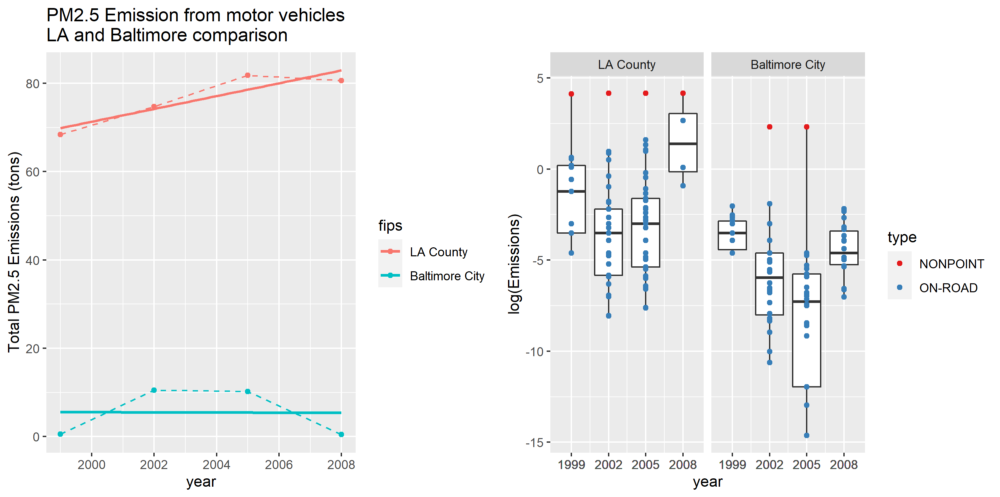
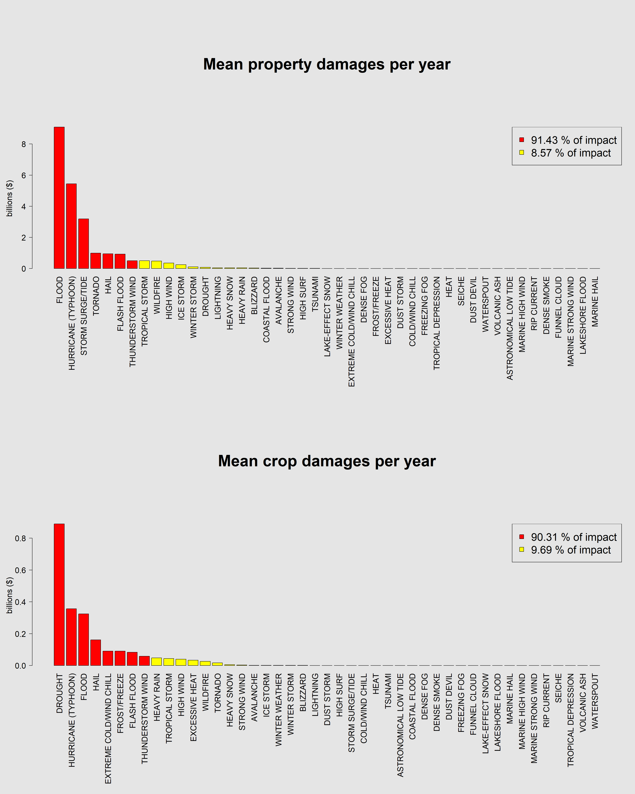
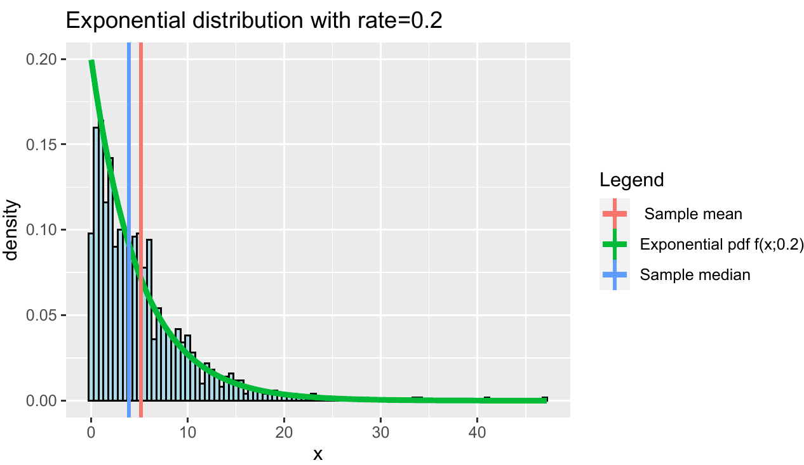
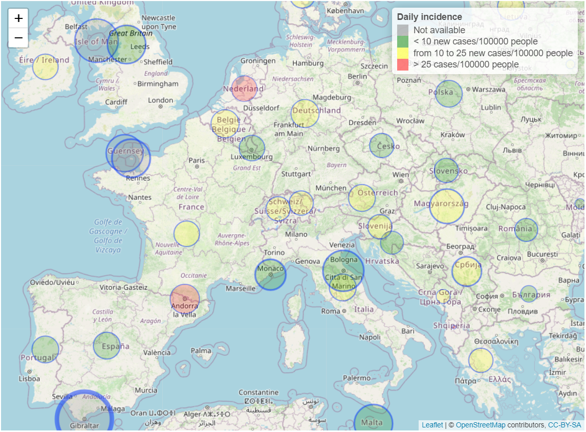
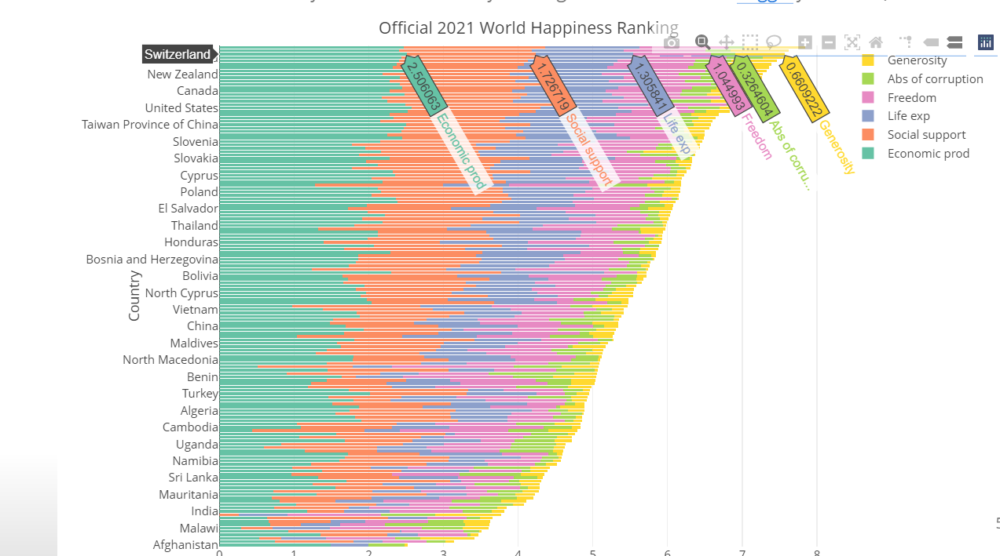
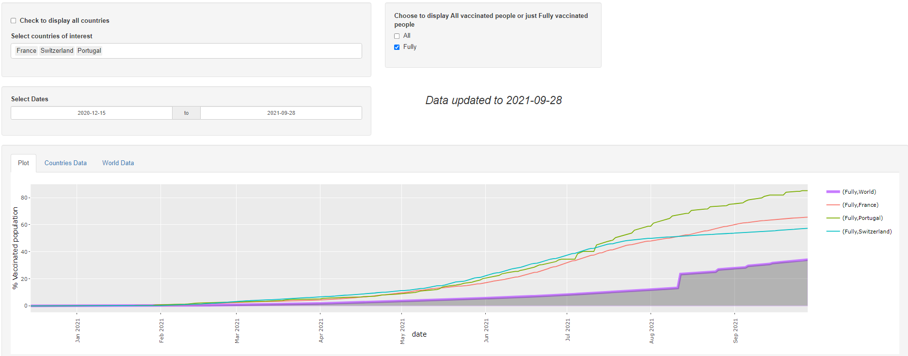
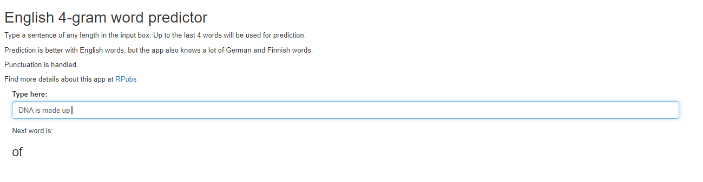
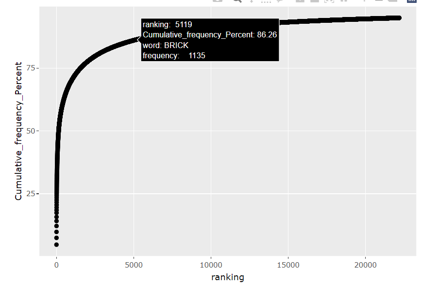
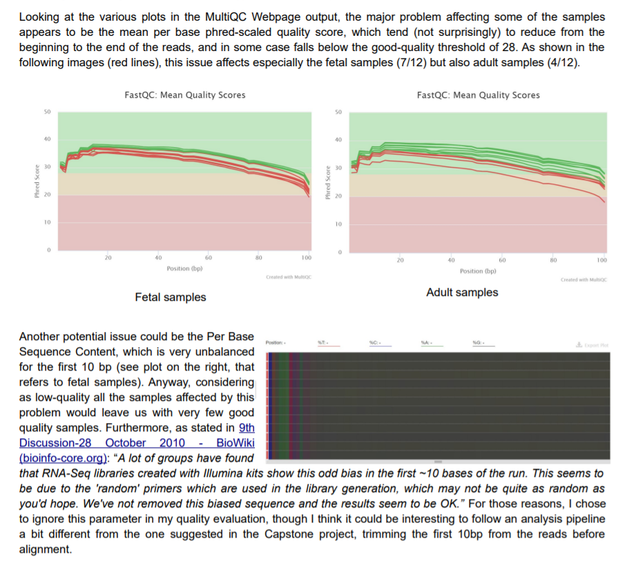
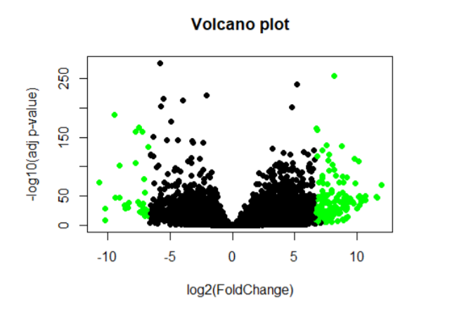

***
## *Example of data cleaning*

> Raw data are collected from Samsung Galaxy S smartphone's accelerometers   
> <a href="https://github.com/Elenena/GettingandCleaningDataCourseProject" target="_blank">GitHub repo</a>

---

## *Plots*    
> 

>    
> 
    

> -   Simple plots using data in the "Individual household electric power consumption Data Set" from UC Irvine Machine Learning Repository   
> <a href="https://github.com/Elenena/ExData_Plotting1" target="_blank">GitHub repo</a>   
> -   More advanced plots about Fine Particulate levels in the US   
> <a href="https://github.com/Elenena/AnalysisPM2.5US_pollution_data" target="_blank">GitHub repo</a>
> -   Exploratory plots on Samsung Galaxy S smartphone's accelometers data   
> <a href="https://github.com/Elenena/RepData_PeerAssessment1/tree/master/PA1_template_files/figure-html" target="_blank">GitHub repo</a>    

---

##  
     
>      
> <a href="https://rpubs.com/Elenena/ReproducibleReaserchProj" target="_blank">Read on RPubs</a>    
> 
  
 

---

> **The transmission type effect on Miles per gallon in the mtcars R dataset**    
> <a href="MPG_vs_Transmission.pdf" target="_blank">PDF file</a>

---

> **Analysis of the exponential distribution and application of the Central Limit Theorem via simulation experiment**    
> 

> 
> <a href="Simulation_exercise.pdf" target="_blank">PDF file</a>    
> 
     
 

---

> **Exploratory analysis and Hyphotesis testing on the ToothGrowth R dataset**   
> 

> 
> <a href="ToothGrowth.pdf" target="_blank">PDF file</a>    
> 

 

---

> **Machine Learning project: Human activity recognition on Weigth Lifting Exercices Dataset**   
> <a href="https://elenena.github.io/PracticalMachineLearningProject_WLEdataset/" target="_blank">Webpage</a>   

---

>  **Interactive COVID Vaccine World Map with Leaflet** (showing data available at 5/4/2021 and providing R code to generate up-to-date maps)   
> 

>      
> <a href="https://elenena.github.io/COVIDmap/covidmap.html" target="_blank">Webpage</a>    
> 

 

---

> **Interactive plot with Plotly about World Happiness Report 2021**   
> 

>      
> <a href="https://elenena.github.io/WorldHappinessReport/WorldHappinessReport.html#1" target="_blank">R markdown Presentation</a>   
> 

 

---

>  **Interactive Shiny App: COVID-19 vaccination rate across countries**   
> 

>    
> 
    

> -    <a href="https://elenena810.shinyapps.io/covid_vaccine_world/" target="_blank">Web App</a>                                                                           
> -    <a href="https://elenena.github.io/DevelopingDataProducts_CourseProject/Shiny_App_COVID_Presentation.html#/" target="_blank">App presentation</a>

---

>  **NLP: Interactive Shiny App for English word prediction** based on a Corpora dataset   
> 

>    
> 
    

> -    <a href="https://elenena810.shinyapps.io/word_predictor/" target="_blank">Web App</a>   
> -    <a href="https://rpubs.com/Elenena/WordPredictor" target="_blank">App presentation</a>    
> -    <a href="https://rpubs.com/Elenena/777174" target="_blank">Preliminary study</a>    
> 

>    
> 
    

***
## *Genomic Data Science*
>  **Re-analysis of fetal and adult brain raw RNA-seq data from the study “Developmental regulation of human cortex transcription and its clinical relevance at base resolution” (Jaffe et al, 2015 Jan
PMID:25501035)**    
> -    <a href="Task_2_Alignment.pdf" target="_blank">Alignment results</a>    
> -    <a href="Task_3_QC.pdf" target="_blank">Quality control results</a>     
> 

>    
> 
    

> -    <a href="ExploratoryAnalysis.pdf" target="_blank">Exploratory analysis</a>    
> -    <a href="DifferentialExpression.pdf" target="_blank">Statistical analysis of differential expression</a>   
> 

>    
> 
    

 
> -    <a href="Final_report.pdf" target="_blank">Final report</a>

***
## *Other*
>    **Pivot table in Google Sheets**   
> -    <a href="https://docs.google.com/spreadsheets/d/e/2PACX-1vRv350OfQFpkwtqOUUYDWNjGtYi3OFPEoa6LEd4REE1dw407RtaOCeWy9GIvXDDjM7IAmNOY4Dx7RKf/pubhtml?gid=1686230677&single=true" target="_blank">Google sheets</a>

>    **Tableau dashboard example**   
<iframe seamless frameborder="0" src="https://public.tableau.com/views/PopulationageandNatalityinEuropefrom1965to2019/Dashboard1?:language=en-US&:embed=yes&:display_count=yes&:showVizHome=no" width="650" height = '4000' scrolling="yes"></iframe>
