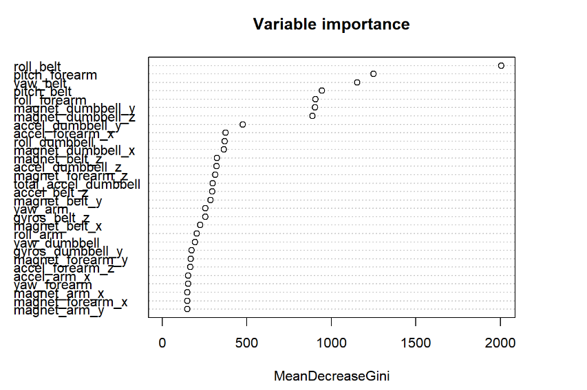

*The majority of the following projects were carried out as a part of one of these Coursera specialisations:*    
-    *Data Science: Foundations using R (Johns Hopkins University)*    
-    *Data Science (Johns Hopkins University)*
-    *Genomic Data Science (Johns Hopkins University)*
-    *Google Data Analytics Professional Certificate*

***
##  Shiny App: COVID-19 vaccination across countries   
<kbd></kbd>   
    

> -    <a href="https://elenena810.shinyapps.io/covid_vaccine_world/" target="_blank">Web App</a> with up-to-date data                                                                          
> -    <a href="https://elenena.github.io/DevelopingDataProducts_CourseProject/Shiny_App_COVID_Presentation.html#/" target="_blank">App presentation</a>   

***

##  NLP: Shiny App for English word prediction   
> The prediction model was built using a Corpora. Here you can find: 
> -    The <a href="https://elenena810.shinyapps.io/word_predictor/" target="_blank">Web App</a>   
> -    An <a href="https://rpubs.com/Elenena/WordPredictor" target="_blank">App presentation</a>    
> -    A <a href="https://rpubs.com/Elenena/777174" target="_blank">Preliminary study</a>     
> 

>    
> 
    
> 
> 

>    
> 
  

---

##  Interactive COVID Vaccine World Map with Leaflet 
> The <a href="https://elenena.github.io/COVIDmap/covidmap.html" target="_blank">map</a> shows data available at 5/4/2021. R code to generate up-to-date maps is provided at the same link.
> 

>         
> 

 
 
---
##  Analysis of european population from 1965 to 2019  
> Data are from the WHO mortality database. Here you can find: 
>    -    A <a href="https://rpubs.com/Elenena/859863" target="_blank">Webpage</a> with details about data and R code used to clean them
>    -    A summary <a href="https://docs.google.com/spreadsheets/d/e/2PACX-1vRv350OfQFpkwtqOUUYDWNjGtYi3OFPEoa6LEd4REE1dw407RtaOCeWy9GIvXDDjM7IAmNOY4Dx7RKf/pubhtml?gid=1686230677&single=true" target="_blank">Pivot table</a> in Google Sheets    
>  -    A Google Slides <a href="https://docs.google.com/presentation/d/1uXwBpA4wvQQbNIw6-48IcGIKFwc36TrM3xye24KXu30/edit?usp=sharing" target="_blank">presentation</a> of my findings    
>  -    A <a href="https://drive.google.com/file/d/16s1oc_OP_Yg_wfdlfSRaaAvV7Zueq8fg/view?usp=sharing" target="_blank">Video</a> of me presenting my findings

> With the following dashboard, built in Tableau, you can directly explore the data:   
<iframe seamless frameborder="0" src="https://public.tableau.com/views/PopulationageandNatalityinEuropefrom1965to2019/Dashboard1?:language=en-US&:embed=yes&:display_count=yes&:showVizHome=no" width="650" height = '4000' scrolling="yes"></iframe>

--- 
##  Genomic data science project: Re-analysis of fetal and adult brain raw RNA-seq data   
> Data are from the study “Developmental regulation of human cortex transcription and its clinical relevance at base resolution” (Jaffe et al, 2015 Jan PMID:25501035). Here you can find documentation for the various steps of the analysis:    
> -    <a href="Task_2_Alignment.pdf" target="_blank">Alignment results</a>    
> -    <a href="Task_3_QC.pdf" target="_blank">Quality control results</a>     
> 

>    
> 
    

> -    <a href="ExploratoryAnalysis.pdf" target="_blank">Exploratory analysis</a>    
> -    <a href="DifferentialExpression.pdf" target="_blank">Statistical analysis of differential expression</a>   
> 

>    
> 
    

 
> -    <a href="Final_report.pdf" target="_blank">Final report</a>

---

##  Exploratory analysis in R of NOAA Storm Data (1996-2010)
> <a href="https://rpubs.com/Elenena/ReproducibleReaserchProj" target="_blank">Read on RPubs</a> my analysis focusing on population health and economic impact of events
> 
     
>         
> 
  
 
---
## Analysis of the exponential distribution in R 
> Read this <a href="Simulation_exercise.pdf" target="_blank">PDF file</a> with details about the simulation experiment and the application of the Central Limit Theorem
> 

>     
> 
     
 

---

## Analysis of the ToothGrowth R dataset   
> Read this <a href="ToothGrowth.pdf" target="_blank">PDF file</a> about exploratory analysis and hyphotesis testing on the dataset
> 

>     
> 

 

---

## Machine Learning project: human activity recognition   
> Human activity recognition on Weight Lifting Exercices Dataset: <a href="https://elenena.github.io/PracticalMachineLearningProject_WLEdataset/" target="_blank">Webpage</a>   
> 

>     
> 
     
 

---

## Plotly chart about World Happiness Report 2021  
> <a href="https://elenena.github.io/WorldHappinessReport/WorldHappinessReport.html#1" target="_blank">R markdown Presentation</a> with interactive plot  
> 

>      
> 

 

---

## Example of data cleaning

> I used raw data collected from Samsung Galaxy S smartphone's accelerometers  to generate tidy training and test datasets    
> <a href="https://github.com/Elenena/GettingandCleaningDataCourseProject" target="_blank">GitHub repo with R code</a>

---

## R Plots    
> 

>    
> 
    

> -   Simple plots using data in the "Individual household electric power consumption Data Set" from UC Irvine Machine Learning Repository   
> <a href="https://github.com/Elenena/ExData_Plotting1" target="_blank">GitHub repo</a>   
> -   More advanced plots about Fine Particulate levels in the US   
> <a href="https://github.com/Elenena/AnalysisPM2.5US_pollution_data" target="_blank">GitHub repo</a>
> -   Exploratory plots on Samsung Galaxy S smartphone's accelometers data   
> <a href="https://github.com/Elenena/RepData_PeerAssessment1/tree/master/PA1_template_files/figure-html" target="_blank">GitHub repo</a>    

---

## The transmission type effect on Miles per gallon

> Read this <a href="MPG_vs_Transmission.pdf" target="_blank">PDF file</a> with an analysis of the *mtcars* R dataset

